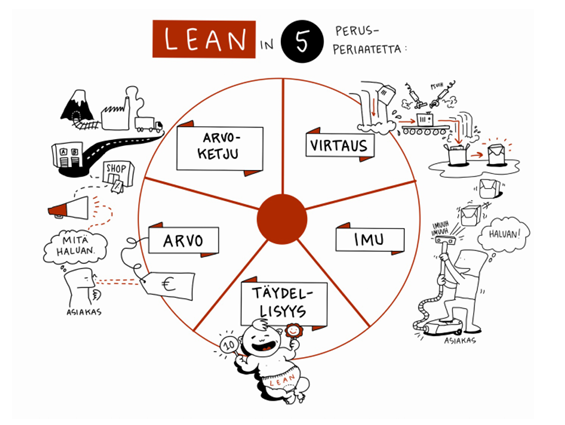

# LEAN-ajattelun synty ja filosofia

Lean on johtamis- ja toimintafilosofia, jonka juuret ovat Japanissa ja erityisesti Toyotan tuotantojärjestelmässä (Toyota Production System, TPS). Johtamisfilosofiana Lean tähtää hukan eli turhan työn ja tuottamattoman toiminnan poistamiseen. Sen avulla pyritään parantamaan asiakastyytyväisyyttä ja laatua, pienentämään toiminnan kustannuksia ja lyhentämään tuotannon läpimenoaikoja.

> Leanin pääperiaate on: oikeita asioita, oikeaan aikaan, oikea määrä, oikeille asiakkaille.  

## Historia

- Toyota kehitti TPS:n vastauksena resurssipulaan toisen maailmansodan jälkeen.
- Toyota Production Systemin keskeisiä kehittäjiä olivat Taiichi Ohno ja Shigeo Shingo.
- Termiä Lean käytti tiettävästi ensimmäisen kerran Bob Hartman artikkelissaan *Triumph of the Lean production system* vuonna 1988.
- Kirja *The Machine That Changed the World* (J.P. Womack, D.T. Jones, D. Roos & D.S. Carpenter, 1990) kertoo Toyotan menestyksestä ja autoteollisuuden muutoksista Lean-tuotantoa kohti sekä esittelee Leanin viisi perusteperiaatetta, jotka ovat:
    - Arvo
    - Arvoketju / Arvovirta
    - Virtaus
    - Imu
    - Täydellisyys
- Kirjan toi käsitteen laajempaan tietoisuuteen ja länsimaat alkoi kiinnostua Leanista 1990-luvulla.
- Sittemmin Lean on laajentunut teollisuudesta mm. palveluihin, terveydenhuoltoon ja ohjelmistokehitykseen.

## Lean filosofia

Asiakas ja asiakkaan tarpeista lähtevä toiminta on Leanin keskiössä. Tehostamiseen pyritään jatkuvan ja systemaattisen kehittämisen kautta. Lean perustuu viiteen periaatteeseen, joiden mukaan prosesseja parannetaan. Kun nämä periaatteet sisäistää, ymmärtää jo paljon siitä, mistä Leanissa on kysymys.

### Viisi perusperiaatetta

1. **Arvo**: Arvon määrittely tapahtuu asiakkaan näkökulmasta. Kaikki tekeminen tähtää arvon tuottamiseen asiakkaalle
2. **Arvoketju**: Arvovirran tunnistaminen ja turhien vaiheiden poistaminen. Miten asiakkaalle tuotetaan palveluja, logistiikkaa, projektin toimittamista ja asiakaspalvelua
3. **Virtaus**: Jatkuva virtaus ilman pullonkauloja. Miten työ saadaan virtaamaan mahdollisimman tehokkaasti?
4. **Imu**: Tuotantoa tehdään tarpeen mukaan, eli tarve "imee" tuotantoketjua eteenpäin. Tehdään vain se mitä tarvitaan, ei ylimääräistä hukkaa.
5. **Täydellisyys**: Jatkuva parantaminen (Kaizen), eli pyritään kohti täydellisesti tehostettua ja häiriöttömästi toimivaa prosessia (jota ei koskaan käytännössä pystytä saavuttamaan).

  
kuva: Lean - Turha työ vähemmäksi, Intotalo Oy

### Muut periaatteet

Lean korostaa myös:

- Ihmisten kunnioittamista
- Ongelmiin puuttumista niiden juurisyistä
- Oppivaa organisaatiota

> Lean ei ole vain joukko työkaluja, vaan ajattelutapa ja kulttuuri, jonka tavoitteena on tehdä vähemmällä enemmän - laadukkaammin, nopeammin ja asiakaslähtöisemmin.

## Lähteet

- Lean - Turha työ vähemmäksi. Intotalo Oy, 2018. [https://www.intotalo.com/wp-content/uploads/2018/03/OPAS-Lean-1.pdf](https://www.intotalo.com/wp-content/uploads/2018/03/OPAS-Lean-1.pdf)
- Wikipedia. Lean. viitattu 20.1.2026 [https://fi.wikipedia.org/wiki/Lean](https://fi.wikipedia.org/wiki/Lean)
- Gaugi, James. What is Lean, Process Excellence Network, 2023. [https://www.processexcellencenetwork.com/lean-six-sigma-business-performance/articles/what-is-lean](https://www.processexcellencenetwork.com/lean-six-sigma-business-performance/articles/what-is-lean)
- Toyota Production System (TPS) & Lean. Strategos Inc, 2007. [https://strategosinc.com/RESOURCES/01-General/toyota_production.htm](https://strategosinc.com/RESOURCES/01-General/toyota_production.htm)
- ChatGPT
